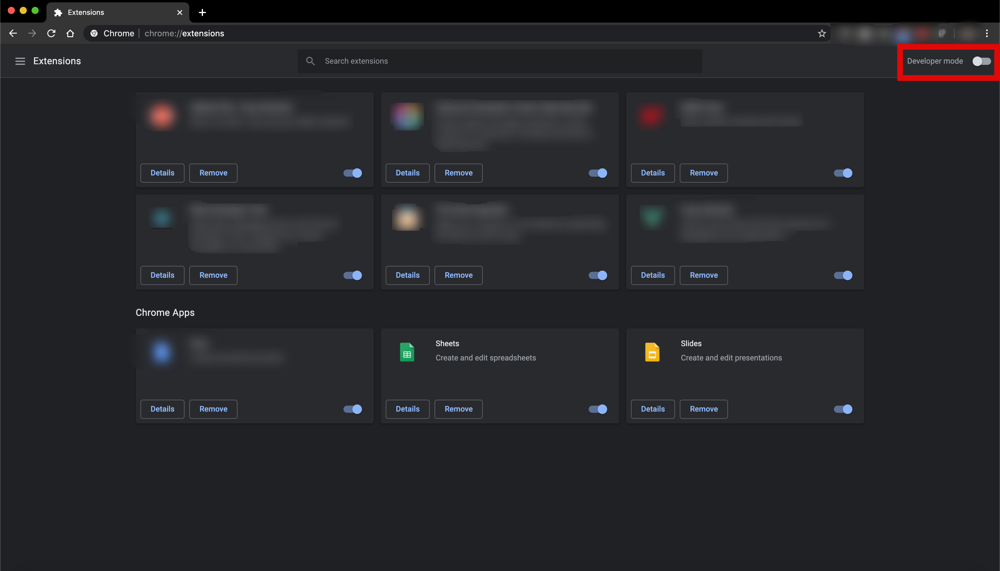

# Instagram downloader

Just a small chrome extension for instagram web to download posted videos and video stories.

## Project setup
```
npm install
```

## How to install extension
Let's navigate to [Chrome extensions](chrome://extensions) tab and enable Developer mode on top right corner




After enabling developer mode, on left top corner will show three buttons, click on *Load unpacked* and choose the root path of the cloned repository.
